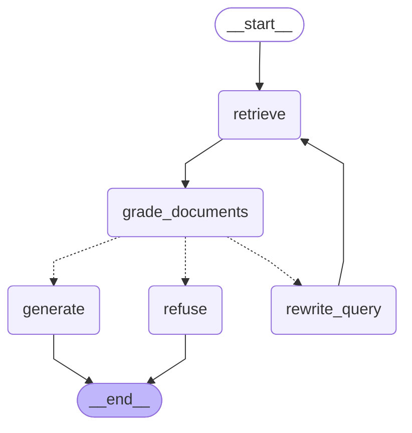
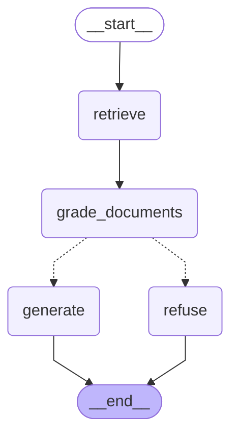

# InspectIQ

Inspection compliance copilot: answers questions about public building codes (the 2010 ADA Standards and the
DOJ guidance in `data/`) with citations `[file p.X §section]`, and refuses when the sources do not answer.
Learning project; the design decisions and the numbers behind them are in [docs/decisions.md](docs/decisions.md).

## Pipeline

- `src/ingest.py`: PDFs → parent sections (headings, regulation paragraphs) → Chroma (sections, children),
  BM25, docstore.
- `src/retrieve.py`: `retrieve(query, filters, config)`: child vectors + BM25, RRF, exact-ref boost,
  cross-encoder rerank with a relevance threshold (empty result → "I don't know").
- `src/answer.py`: baseline chain: `[S#]`-labelled sources → LLM → citation check → number grounding
  (`src/grounding.py`: verified / needs_review / refused).
- `src/graph.py`: LangGraph agent around the same pieces (below).
- `src/llm.py`, `src/tracing.py`: one LLM wrapper (Ollama or Anthropic) with tokens, latency, shadow cost and
  LangFuse traces.
- `src/checklist.py`: checklist flow: each measured item's rule comes from the chain (cited, grounded);
  `compute_outcome()` does the comparison in code (pass / fail / needs_review); a LangGraph review graph pauses
  with `interrupt()` for the inspector and resumes from a SQLite checkpoint (`scripts/review.py`).
- `eval/`: golden and held-out sets; retrieval eval (no LLM) and deterministic answer eval.

## Agent graph (`src/graph.py`)

`grade_documents` makes one yes/no LLM call per source (an unparseable reply counts as "yes");
`generate` is the baseline chain (prompt, citation check, number grounding) on the relevant sources only.

### Grade + rewrite

When no source is graded relevant, `rewrite_query` rewrites the search query in code vocabulary and
retrieval runs again, at most twice; then the graph refuses.



### Grade only

The same graph without the rewrite loop, to measure what the loop adds.



## Run

```bash
.venv/bin/python -m src.ingest                       # build the stores
.venv/bin/python scripts/ask.py "What does 604.5 require?"      # retrieval stages
.venv/bin/python scripts/answer.py "What does 604.5 require?"   # cited answer, grounding, trace URL
.venv/bin/python eval/retrieval_eval.py              # retrieval eval (no LLM)
.venv/bin/python eval/answer_eval.py                 # chain vs graph answer eval
.venv/bin/python scripts/review.py eval/checklists/restroom.json   # inspect a checklist: draft, review, report
.venv/bin/python eval/checklist_eval.py              # drafted checklist outcomes vs expected
.venv/bin/python eval/injection_eval.py              # prompt-injection test on a separate test store
.venv/bin/python -m pytest
```

Configuration comes from `.env` (see `.env.example`); `LLM_PROVIDER=ollama` uses `llama3.2:3b` locally.
